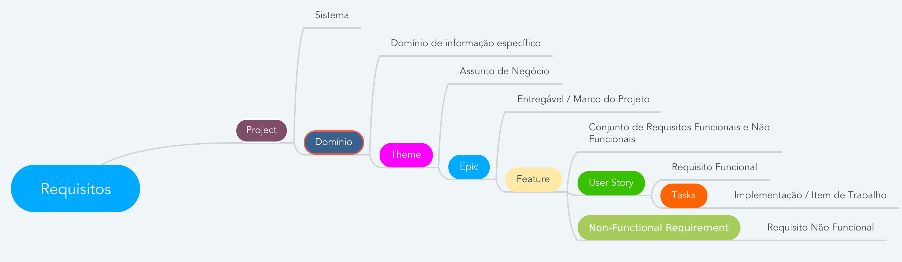

# Gitlab MindMap Generator

Esta é uma aplicação console feita em `C#` com `dotnet` `v5`, que tem como objetivo extrair issues via `API` do `Gitlab` e criar um mapa mental.

Esta aplicação pode ser utilizada para extração de requisitos presentes nas issues, conforme estrutura comentada abaixo.

**`TODO`**: _Adicionar imagem aqui do mapa mental gerado._

<br>

## Configuração da Aplicação

Para executar a aplicação é necessário criar o arquivo `AppSettings.json` na pasta raiz da aplicação. Abaixo segue um exemplo do arquivo de configuração.

```json
{
  "Gitlab": {
    "Url": "https://gitlab.com",
    "ApiUrl": "/api/v4",
    "ApiToken": "<Gitlab-API-Token>",
    "ApiIssuesUrl": "/projects/{0}/issues",
    "ProjectIDs": [""],
    "ProjectLabel": "Project",
    "NodesPattern": "(?<=((\\*|\\-|\\+)\\s~Domain|~Theme|~Epic|~Feature|~\"User Story\").*?\\s\\-\\s)(.*?)(?<=\\))",
    "LabelIconMapping": [
      {
        "Label": "Project",
        "Icon": "desktop_new"
      },
      {
        "Label": "Domain",
        "Icon": "folder"
      },
      {
        "Label": "Theme",
        "Icon": "list"
      },
      {
        "Label": "Epic",
        "Icon": "launch"
      },
      {
        "Label": "Feature",
        "Icon": "bookmark"
      },
      {
        "Label": "User Story",
        "Icon": "male2"
      },
      {
        "Label": "Task",
        "Icon": "pencil"
      }
    ]
  },
  "MindMap": {
    "NodeStyle": {
      "FontName": "Tahoma",
      "FontSize": "16",
      "FontColor": "#000000",
      "BackgroundColor": "#FFFFFF",
      "BorderColor": "#000000"
    },
    "NodeStyleWaiting": {
      "FontName": "Tahoma",
      "FontSize": "16",
      "FontColor": "#000000",
      "BackgroundColor": "#fffad3",
      "BorderColor": "#FFCC00"
    },
    "NodeStyleRunning": {
      "FontName": "Tahoma",
      "FontSize": "16",
      "FontColor": "#000000",
      "BackgroundColor": "#d5eaff",
      "BorderColor": "#0066CC"
    },
    "NodeStyleDone": {
      "FontName": "Tahoma",
      "FontSize": "16",
      "FontColor": "#000000",
      "BackgroundColor": "#ccffcc",
      "BorderColor": "#009933"
    }
  }
}
```

* **Gitlab**:
  * **Url**: URL base de acesso ao Gitlab.
  * **ApiUrl**: URL relativa da API do Gitlab.
  * **ApiIssuesUrl**: URL relativa da API de projetos.
  * **ApiToken**: Token de acesso a API do Gitlab.
  * **ProjectIDs**: Identificação dos projetos que serão lidos pela aplicação. Pode ser o id `numérico` ou `string` do projeto.
  * **ProjectLabel**: Label para identificar a issue principal do projeto.
  * **NodesPattern**: Expressão `regex` para identificação das issues a serem inseridas no mapa mental.
* **MindMap**:
  * **NodeStyle**: Estilo de formatação comum dos nós do mapa mental.
    * **FontName**: Estilo da fonte para o texto do nó.
    * **FontSize**: Tamanho da fonte para o texto do nó.
    * **FontColor**: Cor da fonte para o texto do nó.
    * **BackgroundColor**: Cor de fundo do nó.
    * **BorderColor**: Cor da borda do nó.
  * **NodeStyleWaiting**: Estilo de formatação para issues ainda não iniciadas.
  * **NodeStyleRunning**: Estilo de formatação para issues já iniciadas.
  * **NodeStyleDone**: Estilo de formatação para issues concluídas.

  <br>
## Configuração do Gitlab

Você deve criar uma nova issue nos projetos indicados na configuração `ProjectIDs` e marcar esta issue com a label indicada na configuração `ProjectLabel`.

A aplicação irá iniciar a captura buscando todas as issues que possuem esta label.

Esta label de projeto necessita ser criada no página de `Labels` do próprio Gitlab, podendo ser uma label de projeto ou de grupo.

Em seguida a aplicação irá buscar o padrão `regex` da configuração `NodesPattern` na `descrição` das issues capturadas identificando issues ou nós filhos.

Com base no `NodesPattern` da configuração acima, uma issue de projeto pode ser escrito da seguinte forma:

```
# Project

Any text...

## Domains

+ ~Domain - [DOM2: Requeriments](issue/reference#2)
```

Com base no exemplo acima, a aplicação irá buscar o padrão `+ ~Domain - [DOM2: Requeriments](issue/reference#2)` identificando este como um nó filho da issue de projeto.

A partir de então, a aplicação irá buscar a issue `#2`, analisando sua descrição, buscando novamente o padrão definido na configuração `NodesPattern`. Caso existam outras issues ou nós relacionados a aplicação continuará realizando a leitura das issues identificadas de forma recursiva.

Abaixo segue uma estrutura de issues como exemplo para uma árvore de requisitos:



Você também pode adicionar configurações extras para cada issue ou nó do mapa mental. Para isto basta utilizar os formatos e parâmetros descritos na seção `MindMap` abaixo.

```
# Project

Any text...

## Domains

+ ~Domain - [DOM2: Requeriments](issue/reference#2)

## MindMap

+ **Node-Icons**: desktop_new,help
+ **Node-Font-Name**: SansSerif
+ **Node-Font-Size**: 14
+ **Node-Font-Color**: #000000
+ **Node-Font-Bold**: Yes
+ **Node-Background-Color**: #ccffcc
+ **Node-Border-Color**: #009966
+ **Node-Folded**: Yes
+ **Node-Cloud**: Yes
```

Essas configurações irão sobrepor os estilhos globais definidos no arquivo de configuração.

* **Node-Folded**: Indica se o nó ficará fechado/recolhido escodendo seus filhos.
* **Node-Cloud**: Inclui uma nuvem envolvendo o nó pai e todos os seus filhos. Interessante para criar grupos dentro do mapa mental.

<br>

## Execução

Para executar o projeto basta chamar o assistente do `dotnet` a partir da pasta raiz do projeto:

```shell
dotnet run
```

Um arquivo com o mapa mental será gerado na pasta `Output`.

Atualmente a aplicação suporte a geração de mapas mentais para as seguintes ferramentas:

* [FreeMind](http://freemind.sourceforge.net/wiki/index.php/Main_Page)

<br>

## Links e Referências

* [Tutorial: criar um aplicativo de console .NET usando o Visual Studio Code](https://docs.microsoft.com/pt-br/dotnet/core/tutorials/with-visual-studio-code)
* [Cliente REST](https://docs.microsoft.com/pt-br/dotnet/csharp/tutorials/console-webapiclient)
